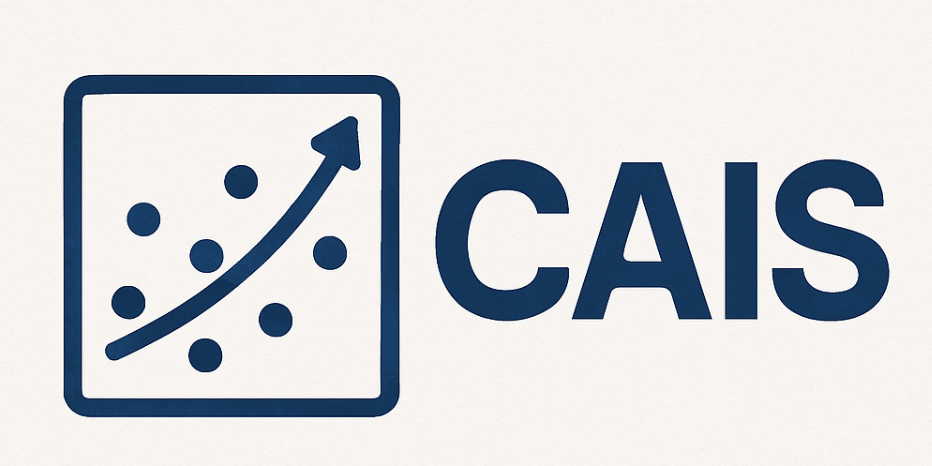

<h1 align="center">

<br>
Causal AI Scientist: Facilitating Causal Data Science with
Large Language Models
</h1>
<!-- <p align="center">
  <a href="https://causalcopilot.com/"><b>[Demo]</b></a> •
  <a href="https://github.com/Lancelot39/Causal-Copilot"><b>[Code]</b></a> •
  <a href="">"Coming Soon"<b>[Arxiv(coming soon)]</b></a>
</p> -->


## 1. Introduction

Causal effect estimation is central to evidence-based decision-making across domains like social sciences, healthcare, and economics. However, it requires specialized expertise to select the right inference method, identify valid variables, and validate results.  

**CAIS (Causal AI Scientist)** automates this process using Large Language Models (LLMs) to:
- Parse a natural language causal query.
- Analyze the dataset characteristics.
- Select the appropriate causal inference method via a decision tree and prompting strategies.
- Execute the method using pre-defined code templates.
- Validate and interpret the results.

<div style="text-align: center;">
    
</div>
</h1>

**Key Features:**
- End-to-end causal estimation with minimal user input.
- Supports a wide range of methods:  
  - **Econometric:** Difference-in-Differences (DiD), Instrumental Variables (IV), Ordinary Least Squares (OLS), Regression Discontinuity Design (RDD).
  - **Causal Graph-based:** Backdoor adjustment, Frontdoor adjustment.
- Combines structured reasoning (decision tree) with LLM-powered interpretation.
- Works on clean textbook datasets, messy real-world datasets, and synthetic scenarios.


CAIS consists of three main stages, powered by a **decision-tree-driven reasoning pipeline**:

### **Stage 1: Variable and Method Selection**
1. **Dataset & Query Analysis**
   - The LLM inspects the dataset description, variable names, and statistical summaries.
   - Identifies treatment, outcome, and covariates.
2. **Property Detection**
   - Uses targeted prompts to detect dataset properties:
     - Randomized vs observational
     - Presence of temporal/running variables
     - Availability of valid instruments
3. **Decision Tree Traversal**
   - Traverses a predefined causal inference decision tree (Fig. B in paper).
   - Maps detected properties to the most appropriate estimation method.

---

### **Stage 2: Causal Inference Execution**
1. **Template-based Code Generation**
   - Predefined Python templates for each method (e.g., DiD, IV, OLS).
   - Variables from Stage 1 are substituted into templates.
2. **Diagnostics & Validation**
   - Runs statistical tests and checks assumptions where applicable.
   - Handles basic data preprocessing (e.g., type conversion for DoWhy).

---

### **Stage 3: Result Interpretation**
- LLM interprets numerical results and diagnostics in the context of the user’s causal query.
- Outputs:
  - Estimated causal effect (ATE, ATT, or LATE).
  - Standard errors, confidence intervals.
  - Plain-language explanation.

---
## 3. Evaluation

We evaluate **CAIS** across three diverse dataset collections:  
1. **QRData (Textbook Examples)** – curated, clean datasets with known causal effects.  
2. **Real-World Studies** – empirical datasets from research papers (economics, health, political science).  
3. **Synthetic Data** – generated with controlled causal structures to ensure balanced method coverage.

### **Metrics**
We assess CAIS on:
- **Method Selection Accuracy (MSA)** – % of cases where CAIS selects the correct inference method as per the reference.
- **Mean Relative Error (MRE)** – Average relative error between CAIS’s estimated causal effect and the reference value.


<h1 align="center">
<div style="text-align: center;">
    
</div>
</h1>

<div style="text-align: center;">
    
</div>
</h1>


---

## Getting Started


#### 🔧 Environment Installation


**Prerequisites:**
- **Python 3.10** (create a new conda environment first)
- Required Python libraries (specified in `requirements.txt`)


**Step 1: Copy the example configuration**
```bash
cp .env.example .env
```

**Step 2: Create Python 3.10 Environment**
```bash
# Create a new conda environment with Python 3.10
conda create -n causal-copilot python=3.10
conda activate causal-copilot
pip install -r requirement.txt
```
**OR**

**Step3: Run Setup Script**
```bash
pip install -e .
```

## Dataset Information 

All datasets used to evaluate CAIA and the baseline models are available in the data/ directory. Specifically:

* `all_data`: Folder containing all CSV files from the QRData and real-world study collections.
* `synthetic_data`: Folder containing all CSV files corresponding to synthetic datasets.
* `qr_info.csv`: Metadata for QRData files. For each file, this includes the filename, description, causal query, reference causal effect, intended inference method, and additional remarks.
* `real_info.csv`: Metadata for the real-world datasets.
* `synthetic_info.csv`: Metadata for the synthetic datasets.

## Run 
To run the program, one can run
```python
python main/run_cais.py --csv_path path/to/meta.csv --data_folder path/to/data --output_folder path/to/output --llm_name gpt-4
```
Args:
* csv_path (str): Path to the CSV file containing the queries, dataset descriptions, and data file names.
* data_folder (str): Path to the folder containing the data CSV files.
* output_folder (str): Folder where the output JSON results will be saved.
* llm_name (str): Name of the LLM to be used (e.g., 'gpt-4', 'claude-3', etc.).

  
A specific example, 
```python
python main/run_agent.py -f data/test.csv -d data/all_data -t test -o output -l gpt-4o-mini 
```


``

**⚠️ Important Notes:**
- Keep your `.env` file secure and never commit it to version control

## License

Distributed under the MIT License. See `LICENSE` for more information.


## Contributors


**Core Contributors**: Vishal Verma, Sawal Acharya, Devansh Bhardwaj

**Other Contributors**:  Zhijin Jin, Ana Hagihat, Samuel Simko

---

## Contact

For additional information, questions, or feedback, please contact ours **[Vishal Verma](vishalv@andrew.cmu.edu)**, **[Sawal Acharya](sawal386@stanford.edu)**, **[Devansh Bhardwaj](bhardwajdevansh398@gmail.com)**. We welcome contributions! Come and join us now!

